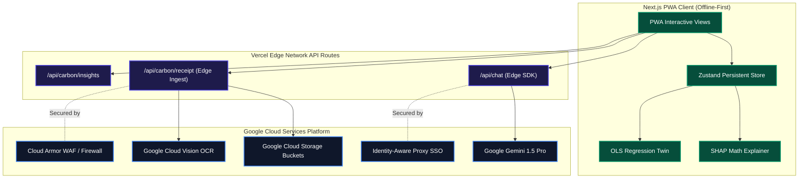

# CarbonPulse AI+ System Architecture Specification

This document details the system design, data flows, security boundaries, and modular component relationships of the redesigned CarbonPulse AI+ PWA.

---

## 1. High-Level Architectural Diagram

CarbonPulse AI+ operates as a serverless, local-first Progressive Web Application. All heavy calculations are performed directly on the client side, while advanced ML tasks and secure storage interface with Google Cloud services via edge API routing handlers.



---

## 2. Component Hierarchy & Clean File Layout

We segment components strictly by functional concern to satisfy line limits (files < 300 lines; functions < 50 lines) and enable efficient dynamic imports.

```
src/
├── app/                  # Next.js App Routing shells & metadata definitions
│   ├── onboarding/       # Onboarding questionnaire container
│   └── dashboard/        # Central command center shell
├── components/           # Reusable generic UI primitives (shadcn UI buttons, tabs)
├── features/             # Sub-feature domain blocks
│   ├── landing/          # Landing-specific widgets (LandingTwinPreview)
│   ├── onboarding/       # Onboarding form sliders
│   ├── dashboard/        # Gauge, OcrScanner, ChatCoach, Logs, and Shap cards
│   └── twin/             # TwinAvatar model and TwinForecastChart line graph
├── hooks/                # Reusable custom hooks (e.g. useMounted)
├── services/             # REST call instantiators for Gemini / OCR Vision APIs
├── lib/                  # Store core instantiators (useCarbonStore.ts)
├── utils/                # Pure mathematical, sanitization, and rate-limiting scripts
└── types/                # Strict TypeScript domain interfaces
```

---

## 3. Data & Core Calculation Flows

### 1. Game-Theoretic SHAP Calculations
1. The client logs are parsed and grouped by category (transit, food, etc.).
2. The custom mathematical SHAP model ([`shapEngine.ts`](file:///c:/Users/adity/Downloads/Election-Process-main/ecotrace-ai/frontend/src/lib/shapEngine.ts)) computes relative marginal contributions:
$$\phi_i(v) = \sum_{S \subseteq N \setminus \{i\}} \frac{|S|!(|N| - |S| - 1)!}{|N|!} (v(S \cup \{i\}) - v(S))$$
3. Contributions are normalized against baseline targets and visually output on the dashboard as percentage weights.

### 2. Digital Twin Regression Forecasting
1. Daily carbon emissions coordinates are compiled into a time-series trendline.
2. The forecasting engine ([`twinRegression.ts`](file:///c:/Users/adity/Downloads/Election-Process-main/ecotrace-ai/frontend/src/lib/twinRegression.ts)) fits an Ordinary Least Squares (OLS) slope:
$$y = m \cdot x + c$$
3. Adjusting slider values dynamically recalculates projected yields over 30, 60, and 90 days.

---

## 4. Multi-Layer Security Architecture

1. **Edge Rate Limiting**: All API endpoints use an IP-based token-bucket rate limiter ([`rateLimiter.ts`](file:///c:/Users/adity/Downloads/Election-Process-main/ecotrace-ai/frontend/src/utils/rateLimiter.ts)) restricting client flooding.
2. **Content Security Policy (CSP)**: Safe CSP headers configured in `next.config.ts` restrict style/script execution sources, blocking cross-site scripting vectors.
3. **MIME/Size Filters**: Files uploaded for OCR receipt annotation are checked against strict MIME type constraints (only JPEG/PNG/WebP) and capped at 4MB to prevent payload exhaustion.
4. **Input & Output Sanitization**: Dynamic strings are validated on entry using Zod schemas, and responses are regex-escaped ([`sanitize.ts`](file:///c:/Users/adity/Downloads/Election-Process-main/ecotrace-ai/frontend/src/utils/sanitize.ts)) to shield rendering views.
5. **GCP Layer Hardening**: Production deployments connect with Google Identity-Aware Proxy (IAP) for single-sign-on OAuth verification and rely on Cloud Armor policies to filter out network threats.
