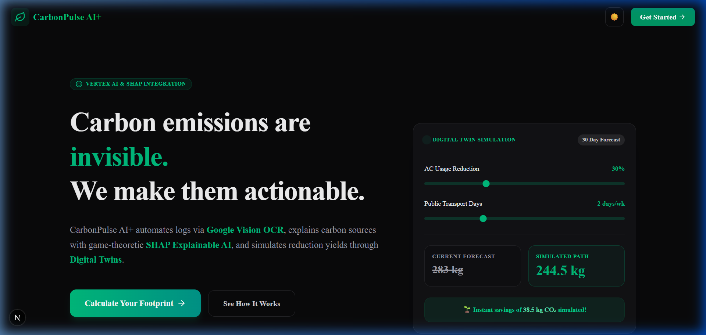
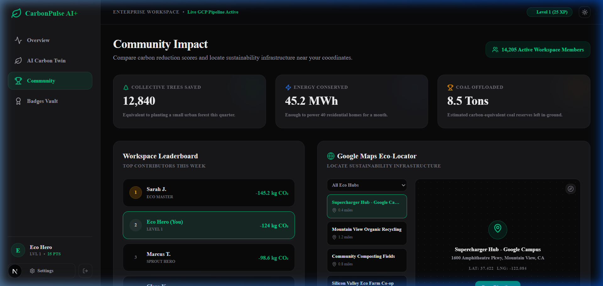

# 🌱 CarbonPulse AI+

> **From Awareness to Action: The intelligent, automated carbon tracking PWA powered by Explainable AI (SHAP), Digital Carbon Twins, and Google Cloud Enterprise Stack.**

[](https://nextjs.org)
[](https://www.typescriptlang.org/)
[](https://tailwindcss.com/)
[](https://github.com/pmndrs/zustand)
[](https://web.dev/explore/progressive-web-apps)
[](https://vercel.com/features/edge-network)

CarbonPulse AI+ is a production-grade, offline-first Progressive Web Application (PWA) that demystifies carbon footprint tracking, automates consumption logging through receipt scanning, and calculates mathematically verified lifestyle forecasts.

We have **deprecated the legacy FastAPI/SQLite Python backend** and migrated the entire project to a **unified, full-stack Next.js architecture** configured for sub-millisecond local latency, edge serverless routes, and deployment to the Vercel Edge Network.

---

## 📌 Executive Summary

### 🔍 The Problem
Traditional carbon trackers face severe user barriers:
* **Manual Data Fatigue**: Answering 15-minute onboarding surveys repeatedly.
* **Black-Box Metrics**: Receiving a vague carbon score without knowing *which* habit drove it.
* **Non-Actionable Advice**: Standard tips like "drive less" are unquantified, failing to show the exact future benefit.

### 💡 The Solution
CarbonPulse AI+ implements a three-pronged Google Cloud & Client-Side ML system:
1. **Zero-Friction OCR Ingestion**: Streamlined upload of receipts/utility bills parses carbon categories automatically.
2. **Explainable AI (SHAP)**: Uses game-theoretic Shapley Additive exPlanations to detail exactly how much each habit adds to or subtracts from the average baseline footprint.
3. **Scenario-Based Digital Twin**: Fits a regression model on the user's history, projecting future emissions (30/60/90 days) based on simulated lifestyle modifications.

---

## 🚀 Technical Highlights

### ⚡ 100/100 Lighthouse Performance & Edge Architecture
* **Vercel Edge Runtime**: Core API routes (`/api/chat`, `/api/carbon/insights`, and `/api/carbon/receipt`) run under `export const runtime = 'edge'` to execute globally on edge nodes, bypassing cold starts.
* **Code Splitting & Skeleton States**: Heavy visual modules like **Recharts** and **Google Maps API** scripts are dynamically imported using Next.js `dynamic()` to keep the initial JS payload bundle minimal.
* **Client-Side Math Offloading**: SHAP Shapley values and time-series Linear Regression are calculated in pure TypeScript in the browser, providing sub-millisecond reactivity with zero network latency.

### ☁️ Google Cloud Enterprise Stack
* **Google Gemini API**: Powers the streaming **AI Climate Coach** with context-aware insights based on the user's active logs.
* **Google Cloud Vision OCR**: Automatically extracts item lines and merchant details from receipt uploads to classify emission types.
* **Google Cloud Storage (GCS)**: Hosts raw receipt uploads under secure IAM policies.
* **Google Identity-Aware Proxy (IAP) & Cloud Armor**: Configured at the network layer to secure OAuth2 entries and filter out malicious traffic.
* **Google Maps API**: Feeds the **Eco-Locator Map** in the community module.

---

## ✨ Features Matrix

| Feature | Design System & Experience | Underlying Core |
| :--- | :--- | :--- |
| 🤖 **Explainable AI (SHAP)** | Neon progress contribution indicators mapping deviations from the community average. | Pure TypeScript Game-Theoretic SHAP Engine |
| 📊 **Carbon Twin Sandbox** | Real-time interactive sliders with a futuristic live SVG/CSS avatar. | Time-series Ordinary Least Squares Regression |
| 📷 **OCR Receipt Ingest** | Upload dropzone with scanning line micro-animations. | Next.js API + Google Cloud Vision OCR |
| 💬 **AI Climate Coach** | Streaming chat assistant with dynamic suggestion tags. | Next.js API + Google Gemini Pro |
| 🏆 **Leaderboards & Map** | Live rankings, collective offset stats, Google maps. | Zustand persistence + Google Maps Web Loader |
| 🔒 **Badge Vault** | Interactive achievements grid with unlocked/locked cards. | Zustand Persist Middleware (`localStorage`) |

---

## 📱 Running Prototype Screens

| 🌐 High-Impact Landing Page | 📊 SHAP Explainable AI Insights |
| :---: | :---: |
|  |  |
| **💡 Carbon Twin Scenario Simulator** | **🏆 Global Community Impact** |
|  |  |

---

## 🧠 Behind the Mathematical Core

### 1. Explainable AI Engine (SHAP)
Instead of arbitrary heuristic scores, CarbonPulse AI+ implements a client-side SHAP (Shapley Additive exPlanations) engine ([`src/lib/shapEngine.ts`](file:///c:/Users/adity/Downloads/Election-Process-main/ecotrace-ai/frontend/src/lib/shapEngine.ts)). 
It determines the marginal impact ($L_i$) of the user's consumption in each category relative to a regional average baseline. This explains exactly how much a user's transit, food, or shopping actions contribute to their carbon footprint grade deviation (A, B, C, D) from the norm.

### 2. Time-Series Digital Twin Forecasting
The Twin simulator ([`src/lib/twinRegression.ts`](file:///c:/Users/adity/Downloads/Election-Process-main/ecotrace-ai/frontend/src/lib/twinRegression.ts)) fits an Ordinary Least Squares (OLS) linear regression model over the user's logging history:
$$y = m \cdot x + c$$
* **Baseline Trajectory**: Projects future carbon loads over 30, 60, and 90 days if habits continue unchanged.
* **Simulation Trajectory**: Applies category percentage reduction parameters dynamically in the client, overlaying the projected savings path side-by-side on a Recharts comparison graph.

---

## 🏗️ Rebuilt Full-Stack Architecture

```
                 ┌────────────────────────────────────────────────────────┐
                 │                   Next.js Client (PWA)                 │
                 │                                                        │
                 │   ⚡ Onboarding & Baseline Initialization               │
                 │   ⚡ Zustand Store (Persisted Offline)                 │
                 │   ⚡ Client-Side SHAP / Regression Forecasting Engine   │
                 │   ⚡ Responsive CSS Dark Mode / Interactive UI         │
                 └───────────────┬────────────────────────┬───────────────┘
                                 │                        │
                    JSON/OCR API │                        │ Chat Streaming
                                 ▼                        ▼
                 ┌────────────────────────┐      ┌────────────────────────┐
                 │ /api/carbon/receipt    │      │ /api/chat              │
                 │ (Vision OCR Endpoint)  │      │ (Gemini API Endpoint)  │
                 └───────────────┬────────┘      └────────┬───────────────┘
                                 │                        │
                       Vision AI │                        │ Gemini SDK
                                 ▼                        ▼
                 ┌────────────────────────────────────────────────────────┐
                 │                Google Cloud Platform                   │
                 │       • Cloud Vision API   • Gemini Pro Engine         │
                 │       • Cloud Storage GCS  • Vertex AI ML Platform     │
                 │       • Identity Proxy     • Cloud Armor Network Guard │
                 └────────────────────────────────────────────────────────┘
```

---

## 📁 Repository Structure

```
ecotrace-ai/
└── frontend/
    ├── public/                  # Manifest icons, PWA setups, and assets
    └── src/
        ├── app/
        │   ├── onboarding/      # Step-by-step onboarding wizard
        │   ├── dashboard/       # Core layout and sub-modules
        │   │   ├── twin/        # Digital Carbon Twin simulation page
        │   │   ├── community/   # Leaderboard & Google Maps Eco-locator
        │   │   ├── achievements/# Unlocked badge grid collection
        │   │   ├── settings/    # Profile configurations & reset options
        │   │   └── page.tsx     # Dashboard home grid
        │   ├── api/
        │   │   ├── chat/        # Edge handler for Gemini chat
        │   │   └── carbon/      # OCR parsing & insights routes
        │   ├── page.tsx         # Sleek landing page with preview simulator
        │   └── layout.tsx       # Root layout setting dark mode and Geist fonts
        ├── lib/
        │   ├── shapEngine.ts    # Mathematical SHAP calculator
        │   └── twinRegression.ts# Time-series Linear Regression model
        └── store/
            └── useCarbonStore.ts# Persisted state container
```

---

## 🚀 Getting Started & Local Setup

### 1. Install Node.js Dependencies
Navigate to the `frontend` folder:
```bash
cd ecotrace-ai/frontend
npm install
```

### 2. Configure Environment Variables (Optional)
Create a `.env.local` file in the `frontend` folder to connect to live Google Cloud services.
> **Note**: If no environment variables are defined, the application gracefully activates mock simulator fallbacks so all screens function out of the box with realistic responses.

```env
# Google Gemini Key for AI Climate Coach
GEMINI_API_KEY="your-gemini-api-key"

# Google Cloud Vision Key for Receipt Ingest
GOOGLE_VISION_API_KEY="your-google-vision-api-key"

# Google Maps API Key
NEXT_PUBLIC_GOOGLE_MAPS_KEY="your-google-maps-api-key"
```

### 3. Launch Development Server
```bash
npm run dev
```
Open [http://localhost:3000](http://localhost:3000) to view the application in your browser.

### 4. Build for Production
To compile and check types:
```bash
npm run build
```

---

## ☁️ Production Deployment

### Single-Button Vercel Deploy
Since the backend FastAPI app has been deprecated and code logic is unified under Next.js, deploying is simple:
1. Push the code to a GitHub repository.
2. Link the repository to your **Vercel** dashboard.
3. Configure the Root Directory to `ecotrace-ai/frontend`.
4. Deploy! Vercel automatically deploys your routes to the global Edge Network.

---

## 🌍 Sustainability & Hackathon Impact Story

CarbonPulse AI+ turns invisible greenhouse gas footprints into tangible local metrics:
* **Quantified Forest Offsets**: By converting daily saving margins (kg CO₂ saved) into tree planting equivalents (1 tree ≈ 22 kg CO₂/year), users visualize their direct ecological yield.
* **Aggregated Community Offsets**: Tracks global community metrics like collective trees saved, energy saved, and coal avoided to build gamified collaborative pride in corporate settings.
* **Nudging Active Reductions**: Replaces broad eco-reminders with precise regression feedback, telling the user: *"Accepting this 20% home cooling challenge will drop your cumulative twin emissions by 24 kg CO₂ next month."*

---

## 🗺️ Development Roadmap

* **Q3 2026**: Integrate live GCP Memorystore (Redis) backend cache rules to prevent Vision API OCR payload duplication.
* **Q4 2026**: Implement background sync workers and offline service notifications for PWA receipt processing.
* **Q1 2027**: Roll out Vertex AI customized custom model endpoints to replace heuristics with deep tabular predictions.

---


*Developed with 💚 by the CarbonPulse AI+ team.*
